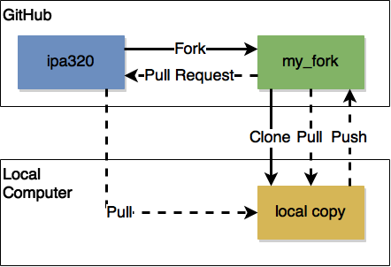
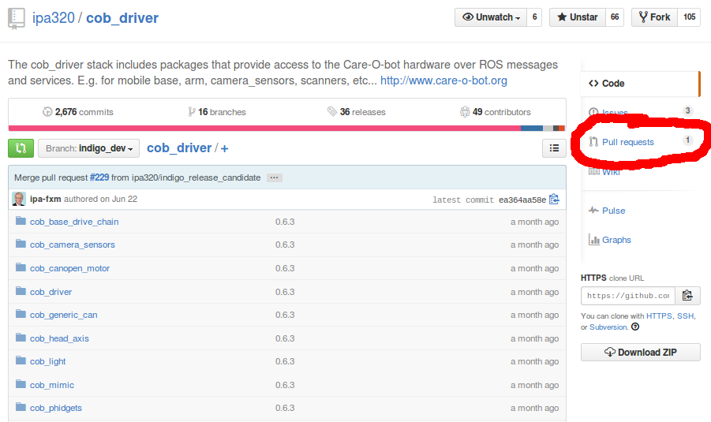
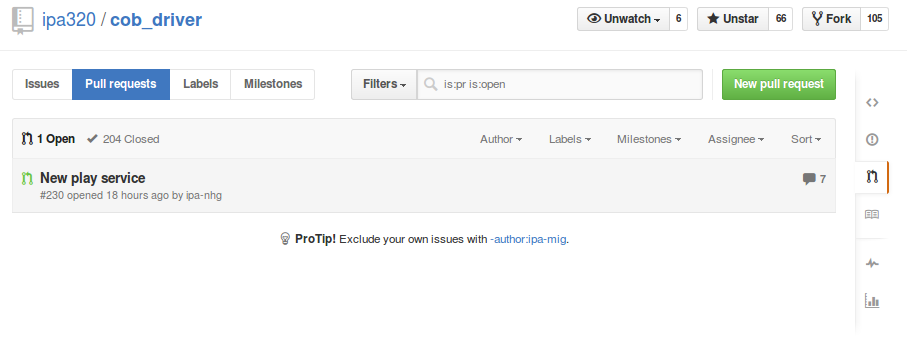
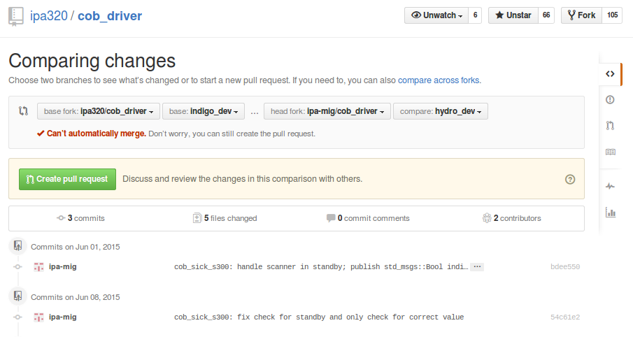

# IPA320 Coding Introduction

This document gives a short introduction into how Coding should be done in IPA320, especially with a focus on 
development within the [Robot Operating System ROS](http://wiki.ros.org/ROS/Introduction).
Thus, it is more a colletion of links to other websites and guidelines than a HowTo.

As the respective tutorials cover a broad spectrum of topics, it is important that you don't just follow them blindly,
but try to understand what is behind the different concepts and commands.


===============================
## ROS Basics
Most of the development within the Servicerobotics Groups in IPA320 happens using the Robot Operating System ROS.
Thus, it is of utmost importance to understand how to install and use ROS and develop algorithms in ROS.
There exists a lot of documentation on the [ROS wiki](http://wiki.ros.org) that gives a thorough
[introduction](http://wiki.ros.org/ROS/Introduction) and explains the concepts behin ROS.
For all people new to ROS, this is a good place to start.


### ROS distributions
Similar to Ubuntu, ROS is developed in so called distributions.
At the time of writing this, the most recent distribution is [ROS Jade](http://wiki.ros.org/jade).
However, most software at IPA320 is running using [ROS Indigo](http://wiki.ros.org/indigo), which is designed to be a 
ROS LTS (long term stable) version.
ROS Indigo targets Ubuntu 14.04 LTS, whereas ROS Jade mainly targets Ubuntu 15.04, but should support 14.04 as well.

**For now, please use ROS Indigo.**


### ROS Installation
If you are working in the IPA Apartment, you have a preinstalled PC, where ROS is configured.
Otherwise, you might have to install ROS yourself.
You can find the respective installation instructions on the ROS wiki for
[Indigo](http://wiki.ros.org/indigo/Installation) and [Jade](http://wiki.ros.org/jade/Installation) (or more general
under http://wiki.ros.org/ROSDISTRO/Installation).


### ROS terminology
In the following, some often occuring terms are shortly described:
- **ROS package**: A ROS package contains the source code, configuration files and/or launch files, encapsulated as
a logically distinct entity.
Thus, it can contain an algorithm for motion planning, a configuration of a robot, or tools for starting up a robot.
- **Node**: A node is an executable ROS programm.
- **Topic**: A topic is a many-to-many communication channel within ROS.
A ROS node can **subscribe** to a topic to get the messages sent on it or **publish** its own message to a topic.
ROS topics can be **remapped** using launch files, i.e. the name of them can be changed.
- **Service**: A ROS service is a one-to-one communication channel between two ROS nodes, providing a
Request-Response pattern.
- **Action**: A ROS action is similar to a service, except that it includes a Feedback channel.
Thus, you have a Goal-Feedback-Result pattern.
- **`catkin`**: catkin is the build tool used within ROS.
It is described in more detail below.
With ROS Groovy, `catkin` replaced `rosbuild` as build tool.
- **Stack**: A ROS stack is the old notion of logically connected packages, like for navigation.
Earlier, a stack has usually been the same as a repository.
Today, the notion of a stack has been replaced by the notion of `meta-packages`.
- **Launch File**: A Launch File is a file for starting one or more ROS nodes.
It has an XML-based syntax.
- **Configuration or YAML File**: YAML files are used for configuring ROS nodes using parameters that are read from the
so called [Parameter Server](http://wiki.ros.org/Parameter%20Server) by ROS nodes
- **`roscore` or `rosmaster`**: The main ROS program, coordinating how nodes communicate.
You can start it using the `roscore` command.
It is also started automatically once you start a launchfile.


### ROS Tutorials
After having read through the [ROS introduction](http://wiki.ros.org/ROS/Introduction) and having installed your system,
you should start working through the [basic ROS Tutorials](http://wiki.ros.org/ROS/Tutorials).
There, the concepts described before are shown in more detail.

Besides the basic Tutorials, there exist several Tutorials for specialized topics, which are listed here for reference
(Note, this is an incomplete list):
- [Care-O-bot](http://wiki.ros.org/Robots/Care-O-bot/Tutorials)
- [Navigation](http://wiki.ros.org/navigation/Tutorials)
- [MoveIt](http://moveit.ros.org/documentation/tutorials/)
- [the ROS buildsystem `catkin`](http://wiki.ros.org/catkin/Tutorials)


### ROS Workspace Setup
In general, a ROS workspace (for more information [click here](http://wiki.ros.org/catkin/workspaces)) looks as follows:
```
workspace_folder/         -- WORKSPACE ROOT
  src/                    -- SOURCE SPACE
    CMakeLists.txt        -- The 'toplevel' CMake file
    package_1/
      CMakeLists.txt
      package.xml
      ...
    package_n/
      CMakeLists.txt
      package.xml
      ...
    repository_1/
      package_in_repo_1/
        CMakeLists.txt
        package.xml
        ...
      package_in_repo_n/
        CMakeLists.txt
        package.xml
        ...
    repository_n\
      ...
  build/                  -- BUILD SPACE
    ...
  devel/                  -- DEVELOPMENT SPACE (set by CATKIN_DEVEL_PREFIX)
    ...
  install/                -- INSTALL SPACE (set by CMAKE_INSTALL_PREFIX)
    ...
```

In short, the `source` space contains your [ROS packages](http://wiki.ros.org/Packages) which might be organised in a Git
Repository (see below for more information on Git).
The `build` space contains cache information when you build your workspace.
The `devel` workspace contains all compiled executables and libraries so that ROS can use them.
This is useful for development and testing.
The ROS packages can also be installed, this is what the `install` space is for.

Check out the [Tutorial on creating a workspace](http://wiki.ros.org/catkin/Tutorials/create_a_workspace) for how to set
it up.


### ROS Coding Styles
Within ROS, there exist Coding Styles for [`C++`](http://wiki.ros.org/CppStyleGuide),
[`python`](http://wiki.ros.org/PyStyleGuide) and [`JavaScript`](http://wiki.ros.org/JavaScriptStyleGuide).
If you create a new package, please try to adhere to those guidelines as much as possible.
**Note** that those guidelines usually build on top of other style guides which should be used for reference as well.

However, if you edit an existing package, **stick to the coding style therein**!
This especially holds for indentation, as having this unified within one file greatly improves readability.

All available editors allow configuration of indentation setinngs, and most even support automatic detection of the
current intendation scheme on opening an existing file.

If you want to follow this from the start (strictly), there is a [linter](https://en.wikipedia.org/wiki/Lint_(software))
for ROS called [`roslint` (see here for installation and usage instructions)](http://wiki.ros.org/roslint)
that can be included in the `CMakeLists.txt`.
But I advise you to do this from the start and check it continuously, otherwise you will most probably get many errors.
(In a small package, we had about 130 errors.
Using the automatic fix propose did fix approximatly 60%).


### Further Reading on ROS
For ROS, there is a lot of documentation available on the net (even though some is outdated).
First, always check the [ROS wiki](http://wiki.ros.org) (or the respective package specific subpages),
if you have questions about ROS.
**Note** that all private ROS repositories from IPA320 cannot be found on the ROS wiki.

A second source of information is the [ROS answers](http://answers.ros.org) homepage.
A lot of questions have been answered there already.
If you register, you can also ask (and obviously also answer) questions to the ROS community.
However, try to be as clear as possible in your question (best also give your system configuration and ROS distribution)
to get a good answer.

Also, there is an
[official ROS Indigo Cheat Sheet](https://github.com/ros/cheatsheet/releases/download/0.0.1/ROScheatsheet_catkin.pdf)
available which shortly introduces the most basic/common commands for using ROS.


===============================
## `Git` Basics
At IPA320, and as a matter of fact for most ROS packages out there, we use a 
[VCS (Version Control System)](https://en.wikipedia.org/wiki/Revision_control) called
[**`Git`**](https://en.wikipedia.org/wiki/Git_%28software%29).
`Git` is a so called Distributed VCS, as it allows you to always check out the full history of the Source Code
Repository you are working on, and not only a specific snapshot.
This makes `Git` a very powerful tool and it is ideally suited to be used in a development environment with many people
working on the same repository.

Our repositories are hosted at [`GitHub`](https://github.com) in an organisation called
[IPA320](https://github.com/ipa320).
Many repositories, especially for the Care-O-bot, are open source, but some are also not publicly available.
There you can always get the latest state of development.


### `Git` terminology
In the following, some often occuring phrases are shortly described:
- **Repository**: The repository is where files' current and historical data are stored, often on a server.
- **Fork**: A fork is a copy of a repository (on GitHub).
This can be used to save changes without having to save them on the main repository (where you usually don't have write
access).
Thus, this is the way to get your changes into the main repository, as described below.
- **Clone**: Cloning means creating a local repository containing the revisions from another repository. 
- **Commit**: To commit is to write the changes made in the working copy back to the repository.
- **Merge**: A merge is an operation in which two sets of changes are applied to a file or set of files.
- **Branch**: A set of files under version control may be branched at a point in time so that, from that time forward,
two copies of those files may develop at different speeds or in different ways independently of each other.
Usually, you develop a new feature on a branch and then merge it into the main branch once it is done.
- **Pull**: Copy revisions from one repository into another.
Pull is initiated by the receiving repository, i.e . you get the changes from a remote repository into your local one.
- **Push**: Push is initiated by the source. I.e. you bring your changes to a remote repository.
- **Pull Request**: To bring your changes from your fork to the main repository, you issue a Pull Request on GitHub.
This notifies the maintainers of the repository that you have a feature developed that you want to integrate.


### `Git` Tutorials and Guides
There exist several tutorials about `Git` on the web with respective drawbacks and advantages.
Here is a list of some of them:
- [interactive guide](http://try.github.io/levels/1/challenges/1) for git.
Nice, but covers not everything.
Read everything on the page before typing in the commands.
- [really simple guide, \<Quote\>no deep shit\</Quote\>](http://rogerdudler.github.io/git-guide/).
Looks bad, but covers the essentials.
- [Technical guide, showing what git does internally](http://marklodato.github.io/visual-git-guide/index-en.html)
- [Good guide for understanding the theory behind git](http://think-like-a-git.net/).
However some more examples could be helpful.


### `Git` Workflow
The structure that we usually follow at IPA is shown in the following figure:



Create a fork of the main ipa320 repository you want to work on.
Clone this repository to your local computer and do some work there.
Commit your changes and push them to your fork.
You can then issue a Pull Request to the main repository and update your changes.

You can obviously always pull from both, the main repository or your fork to get any changes from there into your
current local copy.

For this, you obviously need an account at GitHub.
Accounts at GitHub are free, choose a user name (follow the pattern `ipa-<YOURSHORTNAME>`) and register there.
Then, the GitHub Admins at IPA320 can add you to our organisation.


### Issuing a Pull Request
To issue a Pull Request, you need to have pushed your changes to your Fork on GitHub, preferably on a feature branch.
Then, go to the repository where you want your changes to go.
Usually, this is 
```
https://github.com/ipa320/<REPO>
```
There, click on the Pull Request tab

and then on `New Pull Request` in the top right corner.

Then you can choose from which repository (you might have to click `compare across forks`) and which branch you want to
have the Pull Request.
GitHub now provides you with an overview of the commits you have made and indicates, whether this PR can be merged.
It also shows all changes you have made in the respective files.

Thus, you can review your changes again, give the PR a meaningful name and add an explanation about what has changed.
Then click on `Create Pull Request`.

Once you have sent a Pull Request, the package maintainers will review the PR and merge it, if it is okay.
If they find something they want to be changed, they will usually use the comment function on the PR.
Fix the requested changes and update the PR by simply pushing again to the branch from which you set up the PR in the
first place.


### `Git` Do's and Dont's
In the following are some Do's and Dont's that will make life easier for everyone, if you follow them.

**Do**:
- commit often.
- provide meaningful commit messages ('test' or 'debugging' is not a good commit message).
- commit one set of (logically related) changes.
I.e. if you fix two bugs, make to commits.
- review what you will commit using `git status` and `git diff`/`git difftool` before actually commiting.
- before you commit, check for simple whitespace errors using `git diff --check`.
- update your repositories regularly.
- last but not least:
ask your supervisor/a colleague if you are not sure what `git` will do or your repository is in a strange state.

**Don't**:
- commit a state that does not compile.
- commit any temporary files.
- commit any autogenerated files (except for where they are created from a template, e.g. using 
[BRIDE](http://wiki.ros.org/bride)).
- commit any binaries.
- commit large whitespace changes intermixed with changes to the source code.
- commit any files with filemode 755 (i.e. executable files) except for python executables (`.py` containing the `__main__`
function) and `dynamic_reconfigure` configurations (usually located in `<PACKAGE>/cfg/<NAME>.cfg>`).
Regular files have filemode 644.
- create unnecessary merge commits by pulling in changes.


### Further Reading on `Git`
You can find additional information about git in the following resources.
- [The main git resource page](http://git-scm.com/).
Will help a lot, when you already know what you are looking for.
- [GitHub help page](https://help.github.com/).
Answers almost all questions related to GitHub.
- There is also a freely available [Book on Git](https://git-scm.com/book/en/v2).


===============================
## Compiling your ROS workspace
As described above, all ROS packages that you have will reside in the source space of your workspace.
When you create a new package, it needs to go in the `src` folder or in a repository therein.

The ROS buildtool [`catkin`](http://docs.ros.org/api/catkin/html/) builds upon [`CMake`](http://www.cmake.org/)
for setting up the compile flags and options.
Thus, it extends the regular `CMake` syntax by specific `catkin` macros.


### Different compile types
To compile your workspace in the most basic form, go to the root of your workspace and call
```bash
catkin_make
```
This will do a Debug Build of your workspace.
This also means, that there are no compiler optimizations turned on, which might speed up your code.

To do a release build, you need to pass in the `CMAKE_BUILD_TYPE=Release` flag like so
```bash
catkin_make -DCMAKE_BUILD_TYPE=Release
```
Obviously, you can also add any other valid `CMAKE_BUILD_TYPE`s.


There is another type of build, the so called _isolated build_.
This has the advantage of being able to mix `caktin` and non-`catkin`, `CMake`-compliant packages in a single workspace.
The build can be started using
```bash
catkin_make_isolated
```
For most (or all?) repositories at IPA, this is not required.
However, it might help to detect errors that are hidden when simply using `catkin_make`.


The last type is the _install build_.
This installs any compiled (and configured) executables as it would be done when you trigger a release and install
it using `apt-get`.
The install build requires to have a successfull regular or isolated build.
Then, you can execute it by calling either
```bash
catkin_make install
```
or
```bash
catkin_make_isolated --install
```
respectively.


### Creating a ROS package
To [create a new ROS package](http://wiki.ros.org/ROS/Tutorials/catkin/CreatingPackage), go to your source space
(or into a repository therein) and call
```bash
catkin_create_package <PACKAGENAME>
```
This will create the basic package sceleton.
If you already know that you will have some dependencies, you can pass them in already at this stage:
```bash
catkin_create_package <PACKAGENAME> <DEPENDENCIES>
```
for example:
```bash
catkin_create_package my_cpp_package roscpp
```
Dependencies and compiling is handled using two files, that are described in the following.

#### The `CMakeLists.txt`
The [`CMakeLists.txt`](http://wiki.ros.org/catkin/CMakeLists.txt) is the file where you specify what is to be compiled,
which dependencies need to be used in the build process and what files or executables should be installed.
This file is basically a `CMake` file with some `catkin` specific extensions and `CMake Macros`.

#### The `package.xml`
The [`package.xml`](http://wiki.ros.org/catkin/package.xml) defines what is a ROS package.
There, you also have to specify the dependencies that your package has.
This file is used to resolve ROS internal as well as system dependencies (even cross-platform).

#### Correctly configuring your package
What needs to go into the `CMakeLists.txt` and into the `package.xml` is described in detail on the
[`catkin` documentation](http://docs.ros.org/indigo/api/catkin/html/howto/format2/).
Note that this is for the new format of `catkin` (Version 2).

Most packages at IPA320 still follow the 
[legacy Version 1 format](http://docs.ros.org/indigo/api/catkin/html/howto/format1/index.html#how-to-do-common-tasks-1).
But please use Version 2 for any new packages.
There is also a 
[Migration Guide](http://docs.ros.org/indigo/api/catkin/html/howto/format2/migrating_from_format_1.html#migrating-from-format1-to-format2)
available.

### Checking your package configuration
There also exist tools to help you with the package configuration.
One is called [`catkin_lint`](https://github.com/fkie/catkin_lint) and is statically analyzing your `CMakeLists.txt` and
`package.xml` for common errors or unconfigured dependencies.
If it is not installed (and you have sudo privileges), you can install it using
```bash
sudo apt-get install python-catkin-lint
```
Otherwise, you have to clone it into your repository as any other ROS package from https://github.com/fkie/catkin_lint.

To check your package configuration, call
```bash
catkin_lint <PATH/TO/PACKAGE>
```
There are differnet levels of detected problems.
Errors (need to be fixed), Warnings (should be fixed) and notices (would be nice to fix them, but not required at all).
By default, you see only the errors.
But you can turn on the other levels by passing in the `-W<x>` flag, where `x=1` for also showing warnings and `x=2`
for also showing notices, e.g.
```bash
catkin_lint <PATH/TO/PACKAGE> -W2
```

There is another tool called `roscompile`, which should do many of this stuff automatically.
However, I haven't tested it yet properly, and it is not a relased package.
So you would have to clone it from [here](https://github.com/DLu/roscompile).
One thing I noticed on a quick check is that it has problems with special characters like Umlauts.


### Preparing your changes for a Pull Request
Before creating a Pull Request, your source code should pass the following checks:

1. `catkin_lint <PACKAGE>` should not throw any errors (and as few warnings and notices as possibles).
1. Make a clean build, i.e. remove any `build`, `devel` and `install` folders and do a `catkin_make`.
1. Also perform a `catkin_make_isolated`.
1. Check if everything installs using `catkin_make install` or `caktin_make_isolated --install`.
1. Fix any errors that occur in this process.
1. Provide a `README.md` in your package where you describe:
    - the purpose of the node/package,
    - its usage, as well as any
    - subscribed and published Topics,
    - advertised or used Services,
    - ActionClients/Servers, and
    - a list of the respective parameters with
        - a description of their purpose
        - type and
        - default value.
1. For the navigation repositories: please also add a demo config file to `ipa_navigation_config` where you describe
all parameters and set their defaults.
The same holds for a demo launch file (for this node only) in `ipa_navigation_bringup`.

If you adapt a package, you should, obviously, adapt any existing `README.md`, config or launch files accordingly.

Once you've checked the above, you are ready to create the PR.


===============================
## Further Reading within IPA320
There also exist some additional ReadMe's and manuals that give introductions and provide guidelines
how to work at IPA and with the Care-O-bot and rob@work.
Check out the [IPA Manual](https://github.com/ipa320/setup/raw/master/manual_ipa/IPA_manual.pdf) and the 
[Care-O-bot Manual](https://github.com/ipa320/setup/raw/master/manual_cob3Indigo/Care-O-bot_manual.pdf).
You can find those PDFs and the source files hosted on [GitHub](https://github.com/ipa320/setup).


===============================
## HowTo-HowTo
This document is written using [Github Flavored markdown](https://help.github.com/articles/github-flavored-markdown/).
If you want to check what the document looks like without uploading it to GitHub, you can use
[`grip`](https://github.com/joeyespo/grip).

Install it using
```bash
sudo pip install grip
```
Then, move to the `setup/coding_introduction` folder and call
```bash
grip CodingIntroduction.md
```
Launch your browser and connect to `http://localhost:6419`.

**Note** that you still require an internet connection for this to work.

Any (drawn) figures are created using the online tool at https://www.draw.io/.
The source of those files resides in the `figures/src` subdirectory.
